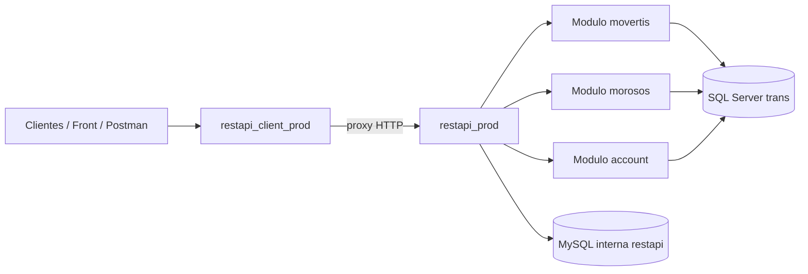

# TRALDISPORTA API - Team Handbook

Guia para que el equipo de desarrollo pueda mantener, evolucionar y operar la API con seguridad.

## 1) Mapa rapido del sistema

- `restapi_prod`: API principal (logica real de negocio).
- `restapi_client_prod`: API proxy para clientes externos (reenvia llamadas a `restapi_prod`).
- `restapi_prod/v1/index.php`: router principal de endpoints productivos.
- `restapi_client_prod/api/v1/index.php`: router proxy de clientes.
- `restapi_prod/modules/*`: modulos de dominio (`movertis`, `morosos`, `account`, etc.).

## 2) Arquitectura (esquema)

## 3) Convenciones de seguridad y acceso

- Header recomendado para autenticacion: `Authorization: <api_key>`.
- `restapi_client_prod` y `restapi_prod` validan API key en middleware `authenticate`.
- Endpoints de administracion usan `authenticate2` (API key admin).
- Evitar exponer passwords/keys en codigo o logs.

## 4) Responsabilidad por capa

### `restapi_client_prod` (capa proxy)
- No debe contener logica de negocio compleja.
- Debe:
  - validar parametros basicos,
  - reenviar `Authorization`,
  - reenviar payload JSON,
  - devolver respuesta de `restapi_prod`.

### `restapi_prod` (capa negocio)
- Aqui vive la logica funcional.
- Las mejoras de negocio van en `modules/*` y se exponen desde `v1/index.php`.

## 5) Dominios funcionales

### Temperatura / Movertis
- Endpoint clave cliente: `POST /getTemperatureDataRAMONEDA`.
- Flujo:
  1) recibe `expeditionOrder`,
  2) traduce a `expeditionCode/centerCode`,
  3) ejecuta `getTemperatureReport`.
- `showvehicles()` usa cache para reducir latencia:
  - cache en MySQL (`movertis_showvehicles_cache`),
  - fallback local en archivo temporal.

### Morosos
- Endpointes clave:
  - `POST /morosos/facturas_pendientes`
  - `POST /morosos/send_report_morosos`
- `hasIncidence()` busca ultima gestion de cobro y se usa en reportes Excel/CSV.

### Accounting
- Endpoints proxy disponibles:
  - `getSaleInvoices`
  - `getBuyInvoices`
  - `getAllMovements`
  - `getMonthlyMovements`
  - `getDetailInvoice`
  - `getDetailInvoiceBuy`

## 6) Checklist para evolucionar endpoints

Cuando se crea o modifica un endpoint:

1. Definir contrato:
   - path,
   - metodo HTTP,
   - body requerido/opcional,
   - formato de respuesta.
2. Implementar en `restapi_prod` (negocio).
3. Si aplica, exponer proxy equivalente en `restapi_client_prod`.
4. Mantener autenticacion consistente (`Authorization`).
5. Añadir/actualizar request en coleccion Postman (`docs/postman`).
6. Validar regresiones en endpoints relacionados.

## 7) Estrategia de pruebas recomendada

- Smoke tests minimos por modulo:
  - 1 caso OK por endpoint clave.
  - 1 caso de validacion (parametro faltante).
  - 1 caso de auth invalida.
- Para temperatura:
  - probar una expedicion que sepais que devuelve datos reales.
  - probar una expedicion sin datos.
- Para morosos:
  - validar generacion de reporte y campos de incidencia.

## 8) Observabilidad y diagnostico rapido

- Revisar logs de llamadas (`logging(...)`) en endpoints criticos.
- Ante respuesta vacia:
  - verificar mapeo de IDs externos (ej. matricula -> idVehicle),
  - verificar cache y vigencia,
  - repetir con refresh forzado de datos externos.

## 9) Operacion y despliegue

- Desplegar primero en entorno de validacion.
- Ejecutar smoke tests de:
  - `getTemperatureDataRAMONEDA`,
  - `morosos/facturas_pendientes`,
  - `getExpeditionsData`,
  - `getSaleInvoices`.
- Confirmar compatibilidad de respuestas para consumidores.

## 10) Deuda tecnica prioritaria (recomendado)

- Unificar y centralizar manejo de errores en ambos routers.
- Documentar formalmente contratos JSON (request/response) por endpoint.
- Añadir tests automatizados de regresion para endpoints criticos.
- Revisar y retirar credenciales hardcodeadas del codigo.

## 11) Propietarios sugeridos por modulo

- Temperatura/Movertis: backend + integraciones externas.
- Morosos/Reporting: backend + negocio financiero.
- Accounting: backend + contabilidad.
- Infra/API Gateway: autenticacion, rate limit, observabilidad.

---

Si se sigue esta guia, cualquier miembro nuevo del equipo puede entender rapidamente:
- donde tocar cada cambio,
- como publicar endpoints sin romper contratos,
- y como validar que la API sigue estable.

