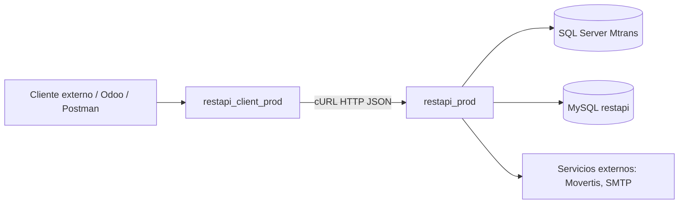
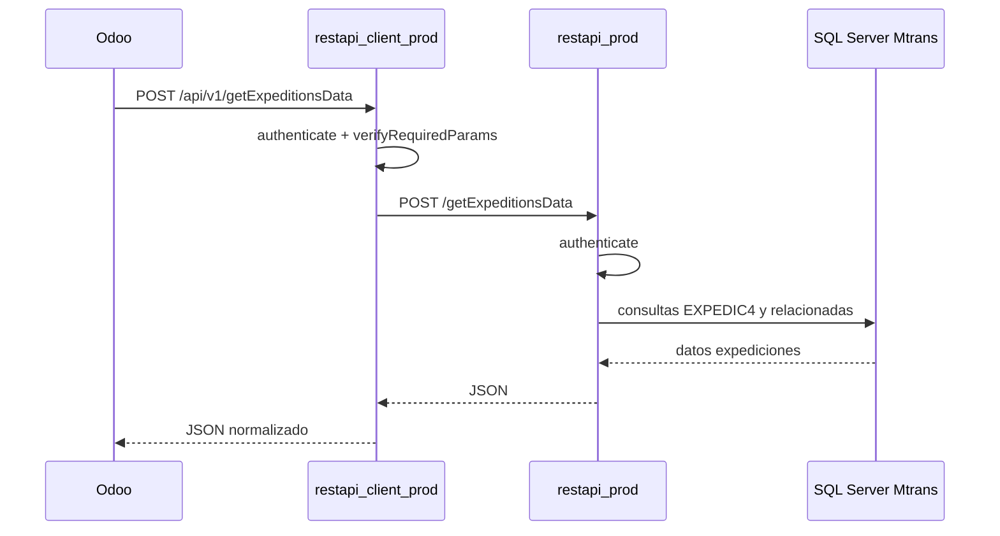
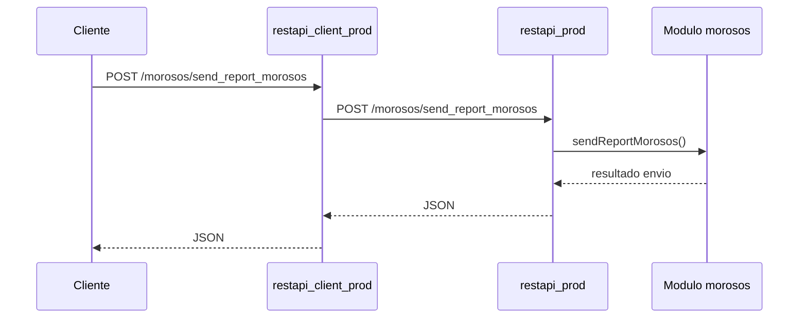

# TRALDISPORTA API - Documentacion tecnica de mantenimiento

## 1. Objetivo

Este documento sirve como guia tecnica para el equipo responsable del mantenimiento evolutivo y correctivo de la API de Traldisporta. Resume la arquitectura, responsabilidades de cada capa, endpoints principales, configuracion, flujos funcionales criticos, puntos de diagnostico y riesgos tecnicos conocidos.

La documentacion esta orientada a desarrolladores backend, integradores y perfiles DevOps que necesiten desplegar, depurar o ampliar el sistema.

## 2. Vista general de arquitectura

El repositorio contiene dos aplicaciones PHP/Slim principales:

- `restapi_client_prod`: capa publica/proxy consumida por clientes externos.
- `restapi_prod`: capa de negocio que consulta Mtrans, bases de datos internas y servicios externos.

Flujo habitual:



### Responsabilidad por capa

`restapi_client_prod` debe actuar como proxy ligero:

- valida API key entrante;
- valida parametros minimos;
- reenvia el payload JSON a `restapi_prod`;
- reenvia el token como header `Authorization`;
- transforma respuestas comunes a formato estable.

`restapi_prod` contiene la logica real:

- consultas a SQL Server Mtrans (`trans`);
- acceso a MySQL interna (`restapi`);
- calculos de expediciones, temperaturas, morosidad y contabilidad;
- integraciones externas con Movertis y SMTP;
- generacion de reportes y PDFs.

## 3. Estructura relevante del repositorio

| Ruta | Funcion |
| --- | --- |
| `restapi_prod/v1/index.php` | Router principal de endpoints de negocio. |
| `restapi_prod/modules/` | Modulos funcionales: `movertis`, `morosos`, `account`, `facturas_impagadas`. |
| `restapi_prod/include/` | Configuracion, autenticacion, conexiones y helpers. |
| `restapi_prod/class/external/` | Definiciones de tablas/campos Mtrans. |
| `restapi_prod/libs/` y `restapi_prod/vendor/` | Librerias PHP: Slim, PHPMailer, TCPDF, PhpSpreadsheet, Composer. |
| `restapi_client_prod/api/v1/index.php` | Router publico/proxy para clientes externos. |
| `restapi_client_prod/api/include/` | Configuracion del proxy, autenticacion, `CallAPI()`. |
| `restapi_client_prod/morosos/` | UI/reporting de morosos con llamadas propias. |
| `restapi_client_prod/temperature_truck/` | Generacion y artefactos relacionados con temperatura/camiones. |
| `docs/` | Documentacion tecnica y coleccion Postman. |

## 4. Configuracion

### `restapi_prod`

Archivo principal: `restapi_prod/include/Config.php`.

Contiene:

- credenciales MySQL internas;
- credenciales SQL Server Mtrans;
- API key administrativa (`API_KEY_ADMIN`).

Tambien existen conexiones especificas en:

- `restapi_prod/modules/facturas_impagadas/db_connection.php`;
- `restapi_prod/modules/morosos/db_connection.php`.

### `restapi_client_prod`

Archivo principal: `restapi_client_prod/api/include/Config.php`.

Contiene:

- credenciales MySQL de la capa cliente;
- destino de `restapi_prod` mediante `API_PROTOCOL`, `API_HOST`, `API_PORT`, `API_PATH`;
- API key administrativa.

Importante: las credenciales y tokens no deben documentarse con valores reales ni enviarse en logs. A medio plazo conviene moverlos a variables de entorno o gestor de secretos.

## 5. Autenticacion

La autenticacion general se basa en API key.

Header recomendado:

```http
Authorization: <api_key>
```

El proxy tambien intenta recuperar API keys desde variantes de `apikey`, pero para evitar diferencias entre clientes HTTP, proxies y servidores, se recomienda usar siempre `Authorization`.

Funciones clave:

- `getAuthorizationFromRequest()` en `restapi_client_prod/api/include/functions.php`;
- `getAuthorizationFromRequest()` en `restapi_prod/include/functions.php`;
- `authenticate()` para API keys de usuarios;
- `authenticate2()` para acciones administrativas con `API_KEY_ADMIN`.

Advertencia: algunas rutas de `morosos` en `restapi_prod/v1/index.php` no declaran middleware `authenticate`. Si quedan expuestas publicamente, deben revisarse.

## 6. Proxy HTTP y timeouts

La capa cliente reenvia llamadas mediante `CallAPI()` en:

`restapi_client_prod/api/include/functions.php`

Responsabilidades de `CallAPI()`:

- inicializar cURL;
- enviar JSON (`Content-Type: application/json`);
- propagar `Authorization`;
- devolver el JSON recibido de `restapi_prod`;
- convertir errores de transporte en codigo interno `ERR_CURL_REQUEST_FAILED`.

Configuracion relevante:

- `CURLOPT_CONNECTTIMEOUT`: tiempo maximo de conexion;
- `CURLOPT_TIMEOUT`: tiempo maximo total de la llamada.

Nota operativa: `getExpeditionsData` puede tardar mas de 2 minutos y devolver respuestas superiores a 1 MB. Si este endpoint devuelve `There is an error in the cURL request`, revisar primero si el timeout interno del proxy ha expirado.

La instrumentacion recomendada para cURL es registrar:

- `curl_errno($ch)`;
- `curl_error($ch)`;
- URL llamada.

Errores frecuentes:

| cURL errno | Interpretacion |
| --- | --- |
| `7` | No conecta / conexion rechazada. |
| `28` | Timeout. |
| `6` | No resuelve host. |

## 7. Endpoints principales

### Endpoints publicos/proxy (`restapi_client_prod/api/v1/index.php`)

| Endpoint | Funcion |
| --- | --- |
| `POST /agenda` | Consulta agenda Mtrans. |
| `POST /companies` | Empresas. |
| `POST /centers` | Centros. |
| `POST /categories` | Categorias. |
| `POST /sections` | Secciones. |
| `POST /sectors` | Sectores. |
| `POST /total_invoiced` | Total facturado. |
| `POST /getTrucksExpedition` | Camiones por expedicion. |
| `POST /getExpeditionsData` | Datos completos de expediciones. |
| `POST /getSaleInvoices` | Facturas de venta. |
| `POST /getBuyInvoices` | Facturas de compra. |
| `POST /getAllMovements` | Movimientos contables. |
| `POST /getMonthlyMovements` | Movimientos mensuales. |
| `POST /getDetailInvoice` | Detalle factura venta. |
| `POST /getDetailInvoiceBuy` | Detalle factura compra. |
| `POST /getTemperatureDataREDUR` | Temperatura para Redur. |
| `POST /getTemperatureDataRAMONEDA` | Temperatura para Ramoneda. |
| `POST /refreshShowvehiclesCache` | Refresca cache Movertis. |
| `POST /morosos/send_report_morosos` | Envio reporte morosos. |
| `POST /morosos/facturas_pendientes` | Facturas pendientes morosos. |
| `POST /newUser` | Alta usuario, admin. |
| `POST /newPassword` | Cambio password, admin. |

### Endpoints de negocio (`restapi_prod/v1/index.php`)

| Endpoint | Funcion |
| --- | --- |
| `POST /generateUser` | Generacion de usuario, admin. |
| `POST /getExpeditionsData` | Datos de expediciones desde Mtrans. |
| `POST /getTrucksExpedition` | Camiones de una expedicion. |
| `POST /getTemperatureReportRedur` | Informe temperatura Redur. |
| `POST /getTemperatureReportRamoneda` | Informe temperatura Ramoneda. |
| `POST /getShowvehicles` | Vehiculos Movertis. |
| `POST /refreshShowvehiclesCache` | Cache Movertis en BD. |
| `POST /getGPSExpeditionExternal` | GPS expedicion externa. |
| `POST /getGPSExpeditionInternal` | GPS expedicion interna. |
| `POST /generateExpeditionPdfs` | Generacion PDFs. |
| `POST /getTemperaturesExpedition` | Temperaturas de expedicion. |
| `POST /getSaleInvoices` | Facturas venta. |
| `POST /getBuyInvoices` | Facturas compra. |
| `POST /getAllMovements` | Movimientos contables. |
| `POST /getDetailInvoice` | Detalle factura venta. |
| `POST /getDetailInvoiceBuy` | Detalle factura compra. |
| `POST /agenda` | Agenda Mtrans. |
| `POST /companies` | Empresas Mtrans. |
| `POST /centers` | Centros Mtrans. |
| `POST /categories` | Categorias Mtrans. |
| `POST /sections` | Secciones Mtrans. |
| `POST /sectors` | Sectores Mtrans. |
| `POST /total_invoiced` | Total facturado. |
| `POST /unpaid_bills` | Facturas impagadas. |
| `POST /morosos/*` | Gestion y reporting de morosos. |
| `POST /getMonthlyMovements` | Movimientos mensuales. |
| `POST /getYearMovements` | Movimientos anuales. |

## 8. Modulos funcionales

### Movertis y expediciones

Archivo principal:

`restapi_prod/modules/movertis/movertis.php`

Responsabilidades:

- consulta expediciones en SQL Server Mtrans;
- obtiene informacion de recogidas, almacenes, repartos y salas;
- resuelve vehiculos/camiones para informes de temperatura;
- consulta API externa de Movertis;
- mantiene cache de `showvehicles`.

Puntos sensibles:

- `getExpeditionsData()` puede generar respuestas grandes y tardar mas de 2 minutos;
- el endpoint puede recorrer varios centros;
- revisar filtros por `startDate`, `endDate`, `centerCode` antes de ampliar funcionalidad;
- cualquier optimizacion debe preservar la estructura esperada por Odoo u otros consumidores.

### Temperaturas

La orquestacion esta en `restapi_prod/v1/index.php`, especialmente en `getTemperatureReport()`.

Flujo tipico:

1. Se recibe `expeditionOrder`, `expeditionCode` o `centerCode`.
2. Se localiza la expedicion Mtrans.
3. Se resuelven vehiculos/salas.
4. Se llama a Movertis para obtener datos de temperatura.
5. Se devuelve estructura normalizada para consumidor externo.

Ramoneda tiene una validacion especifica de ordenante antes de devolver datos.

### Contabilidad y facturas

Archivo principal:

`restapi_prod/modules/account/account.php`

Responsabilidades:

- facturas de venta y compra;
- movimientos contables;
- detalle de factura;
- mapeo de datos Mtrans como `RegTip`, `RegCtrCod`, `RegSer`, `RegNum`, `TIva`.

Nota: el codigo devuelve `TIva` como codigo procedente de Mtrans (`BasCod` / `RegCodBas`). El mapeo final a impuestos o diarios de Odoo no esta en este repositorio.

### Morosos

Archivo principal:

`restapi_prod/modules/morosos/morosos.php`

Responsabilidades:

- consulta de facturas pendientes;
- incidencias;
- gestion de cobro;
- generacion y envio de reportes.

Endpoints relevantes:

- `POST /morosos/facturas_pendientes`;
- `POST /morosos/send_report_morosos`;
- `POST /morosos/has_incidence`;
- `POST /morosos/gestion_list`;
- `POST /morosos/gestion_detail`.

Riesgo: revisar autenticacion en rutas `morosos` de `restapi_prod`.

### Facturas impagadas

Archivo:

`restapi_prod/modules/facturas_impagadas/impagadas.php`

Responsabilidades:

- consulta de impagados en Mtrans;
- filtrado por fechas, cliente, centro, serie y tipo documental.

## 9. Flujos de integracion

### Cliente externo / Odoo -> expediciones



Payload esperado:

```json
{
  "year": "2026",
  "month": "3",
  "centerCode": "8",
  "startDate": "2026-03-02",
  "endDate": "2026-03-03"
}
```

### Cliente externo -> reporte morosos



## 10. Diagnostico operativo

### Error: `There is an error in the cURL request`

Origen:

`CallAPI()` en `restapi_client_prod/api/include/functions.php`.

Significa que ha fallado la llamada cURL interna desde `restapi_client_prod` hacia `restapi_prod`.

Checklist:

1. Revisar log PHP buscando `CallAPI cURL error`.
2. Verificar `curl_errno`:
   - `28`: timeout;
   - `7`: no conecta;
   - `6`: DNS.
3. Probar la URL directa de `restapi_prod` desde el mismo servidor donde corre `restapi_client_prod`.
4. Comparar tiempo real de respuesta contra `CURLOPT_TIMEOUT`.
5. Validar que el payload enviado por el consumidor es identico al probado en Postman.

### Error de autenticacion

Checklist:

1. Enviar preferentemente `Authorization: <api_key>`.
2. Verificar que la API key exista y este activa en la BD de la capa correspondiente.
3. Revisar diferencias de mayusculas/minusculas si se usa `apikey`.
4. Confirmar que el proxy reenvia la API key a `restapi_prod`.

### Respuestas lentas en `getExpeditionsData`

Checklist:

1. Medir llamada directa a `restapi_prod`.
2. Medir llamada a traves de `restapi_client_prod`.
3. Revisar numero de expediciones devueltas y tamano del JSON.
4. Considerar particionar por dia/centro.
5. Evaluar paginacion o filtro estricto por `centerCode`.

## 11. Procedimiento para modificar endpoints

1. Identificar si el cambio pertenece a negocio (`restapi_prod`) o solo proxy (`restapi_client_prod`).
2. Modificar primero la capa de negocio.
3. Si el endpoint es publico, actualizar o crear su proxy en `restapi_client_prod`.
4. Mantener formato de respuesta compatible con consumidores existentes.
5. Actualizar documentacion y coleccion Postman.
6. Ejecutar pruebas smoke.
7. Revisar logs de errores PHP y respuestas JSON.

## 12. Pruebas smoke recomendadas

Ejecutar tras cada despliegue:

| Area | Endpoint | Caso minimo |
| --- | --- | --- |
| Auth | cualquier endpoint autenticado | API key valida e invalida. |
| Expediciones | `POST /getExpeditionsData` | rango de 1 dia con datos conocidos. |
| Temperatura | `POST /getTemperatureDataRAMONEDA` | `expeditionOrder` valido. |
| Contabilidad | `POST /getSaleInvoices` | rango corto de fechas. |
| Detalle factura | `POST /getDetailInvoice` | factura conocida. |
| Morosos | `POST /morosos/facturas_pendientes` | rango corto. |
| Reporte morosos | `POST /morosos/send_report_morosos` | validacion controlada, evitar envio masivo accidental. |

## 13. Riesgos tecnicos conocidos

| Riesgo | Impacto | Recomendacion |
| --- | --- | --- |
| Credenciales hardcodeadas | Exposicion de secretos y dificultad de rotacion. | Migrar a variables de entorno o vault. |
| Timeouts globales para endpoints pesados | Cortes en llamadas largas. | Ajustar por endpoint u optimizar consultas. |
| Rutas `morosos` sin middleware en prod | Acceso no controlado si estan expuestas. | Aplicar `authenticate` o restringir por red. |
| Duplicidad de URLs y credenciales | Cambios inconsistentes entre modulos. | Centralizar configuracion. |
| CORS amplio | Mayor superficie de exposicion. | Restringir origenes si hay consumidor definido. |
| `display_errors` en produccion | Posible fuga de informacion. | Desactivar en entorno productivo. |
| SSL verify deshabilitado en integraciones | Riesgo MITM. | Activar verificacion y gestionar certificados. |
| Archivos temporales/PDFs en repo | Ruido, peso y riesgo operativo. | Excluir temporales y aplicar limpieza periodica. |

## 14. Recomendaciones de mejora priorizadas

1. Centralizar configuracion sensible fuera del repositorio.
2. Normalizar autenticacion en todos los endpoints, incluyendo `morosos`.
3. Separar timeouts por endpoint o permitir timeout configurable.
4. Optimizar `getExpeditionsData` para respetar filtros, paginar o reducir payload.
5. Documentar contratos JSON request/response de endpoints criticos.
6. Añadir tests automatizados o scripts smoke.
7. Revisar logs y errores para no devolver mensajes genericos sin trazabilidad.
8. Unificar nombres de endpoints cliente/prod cuando difieren por convencion.

## 15. Fuentes de referencia

- `docs/API_TEAM_HANDBOOK.md`: guia breve de equipo.
- `docs/postman/Traldisporta_Client_API.postman_collection.json`: coleccion Postman.
- `restapi_client_prod/api/v1/index.php`: endpoints publicos/proxy.
- `restapi_client_prod/api/include/functions.php`: proxy cURL, auth y helpers.
- `restapi_prod/v1/index.php`: endpoints de negocio.
- `restapi_prod/modules/movertis/movertis.php`: expediciones/Movertis.
- `restapi_prod/modules/account/account.php`: contabilidad/facturas.
- `restapi_prod/modules/morosos/morosos.php`: morosos/reporting.
- `restapi_prod/modules/facturas_impagadas/impagadas.php`: impagados.

